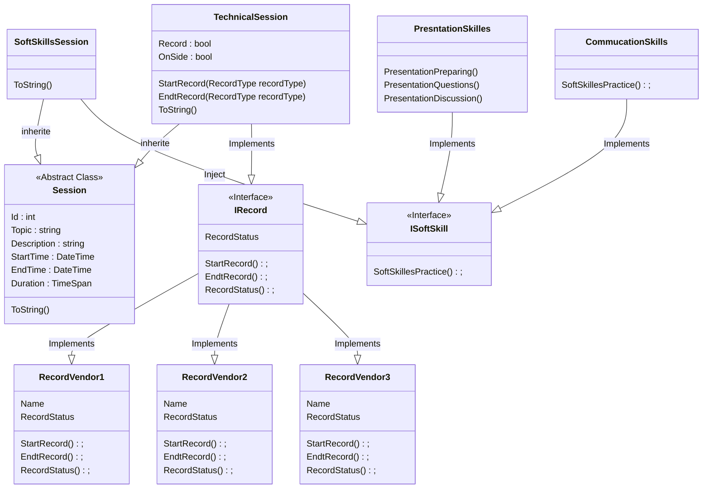

## UML Diagram

```mermaid
classDiagram
	class Session{
    <<Abstract Class>>
	    Id : int
        Topic : string 
        Description : string 
        StartTime : DateTime 
        EndTime : DateTime  
        Duration : TimeSpan 
        ToString()
	}

    class TechnicalSession{
        Record : bool
        OnSide : bool
        StartRecord(RecordType recordType)
        EndtRecord(RecordType recordType)
        ToString()
    }
    TechnicalSession --|> Session : inherite

    class SoftSkillsSession{
        ToString()
    }
    SoftSkillsSession --|> Session : inherite
    SoftSkillsSession --|> ISoftSkill : Inject

    class IRecord{
    <<Interface>>
        RecordStatus
        StartRecord();
        EndtRecord();
        RecordStatus();
    }
    class RecordVendor1{
        Name
        RecordStatus
        StartRecord();
        EndtRecord();
        RecordStatus();

    }
    class RecordVendor2{
        Name
        RecordStatus
        StartRecord();
        EndtRecord();    
        RecordStatus();

    }
    class RecordVendor3{
        Name
        RecordStatus
        StartRecord();
        EndtRecord();
        RecordStatus();

    }
    TechnicalSession --|> IRecord : Implements
    IRecord --|> RecordVendor1 : Implements
    IRecord --|> RecordVendor2 : Implements
    IRecord --|> RecordVendor3 : Implements

    class ISoftSkill{
    <<Interface>>
        SoftSkillesPractice();
    }

    class PresntationSkilles{

        PresentationPreparing()
        PresentationQuestions()
        PresentationDiscussion()

    }
    PresntationSkilles --|> ISoftSkill : Implements
    class CommucationSkills{

        SoftSkillesPractice();

    }

    CommucationSkills --|> ISoftSkill : Implements
	
```
 // diff Interface Vs Abstract